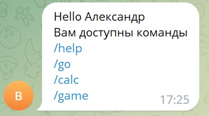
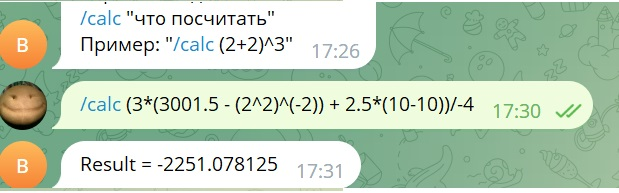
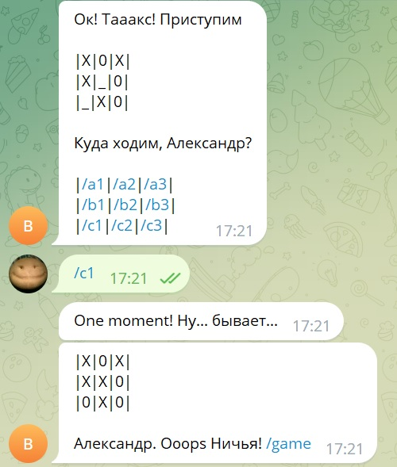

## Телеграм-бот https://t.me/trfim63_bot

# Файл teleBot.py - добавлена игра с конфетами
# Файл newBot.py - отдельно игра с конфетами на старой библиотеке - попроще в реализации

# Есть опции меню:

- вычисление выражений (из задачи "калькулятор")

- Крестики-нолики "/game"
- Конфеты "/sweet"

Коме того игры запускаются обычными сообщениями 'Sweet' и 'Crest'

В Конфетах используется обмен текстовыми сообщениями без команд
