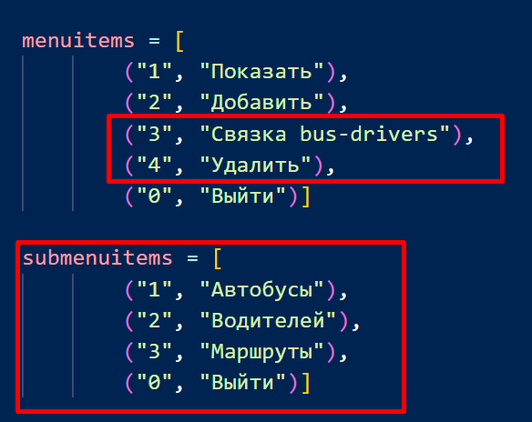

Добавил опции меню:
- "Связка автобус-водитель"
- "Удалить"
- Использовал подменю

Новые опции выполняет новый модуль "selection"

## Связка автобусы-водители
работает примерно так:

Введите гос.номер автобуса  м123тр96

Выводится список
- М123ТР96  Петров
- М123ТР96  Михайлов

